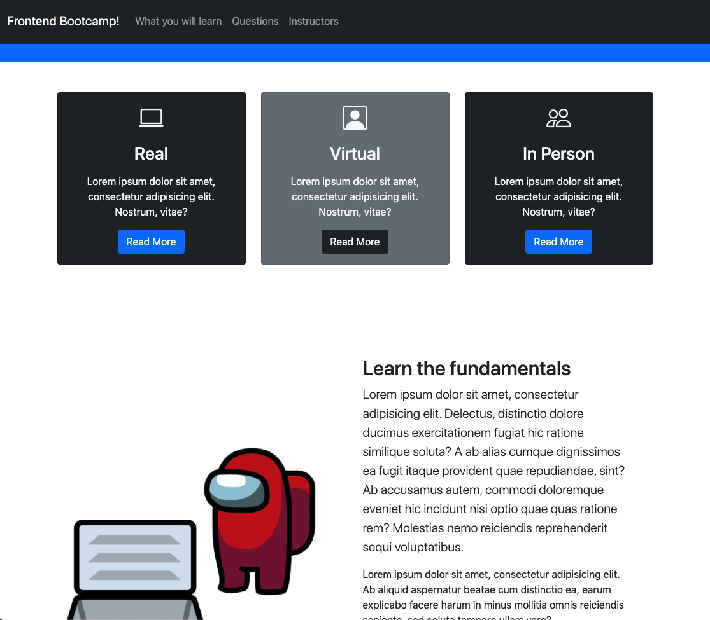
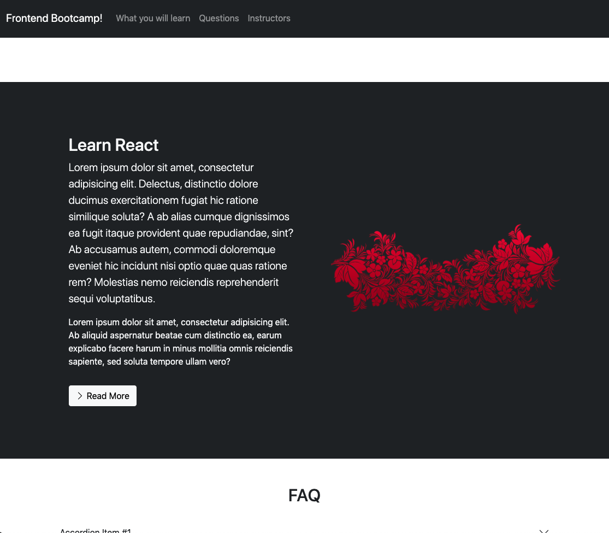
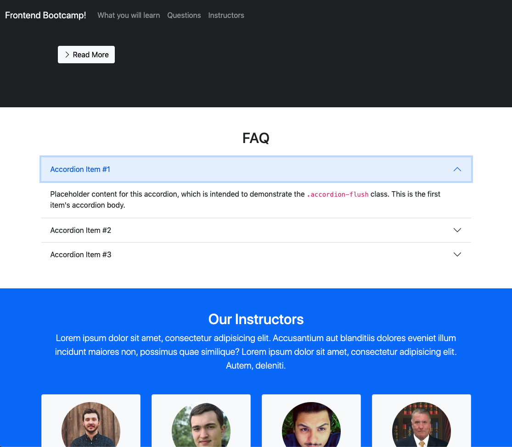
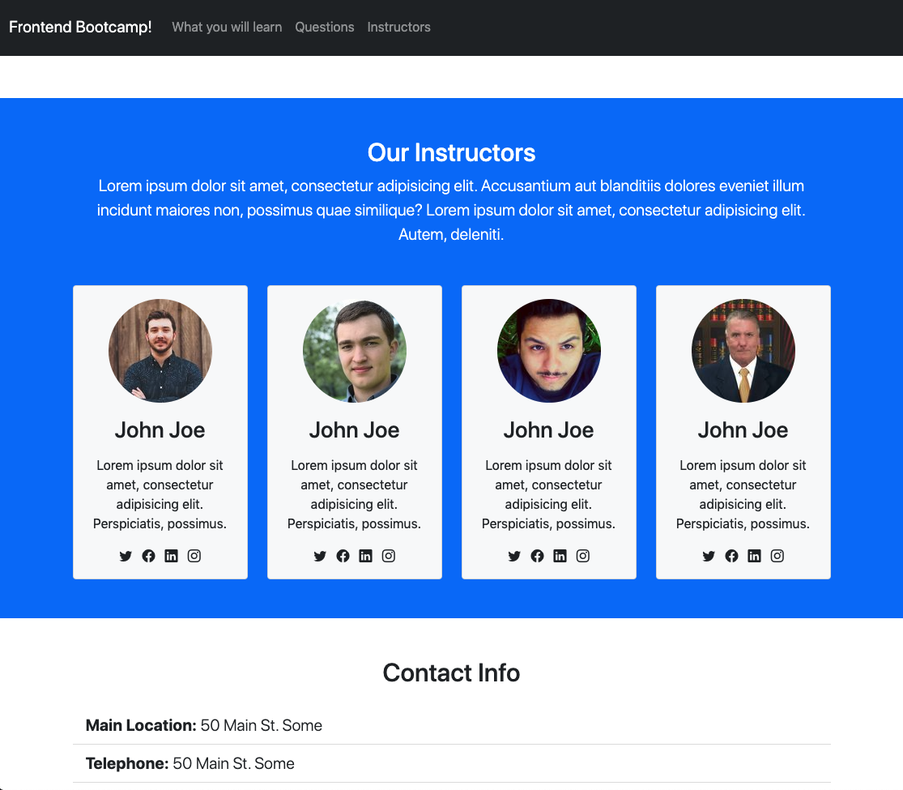
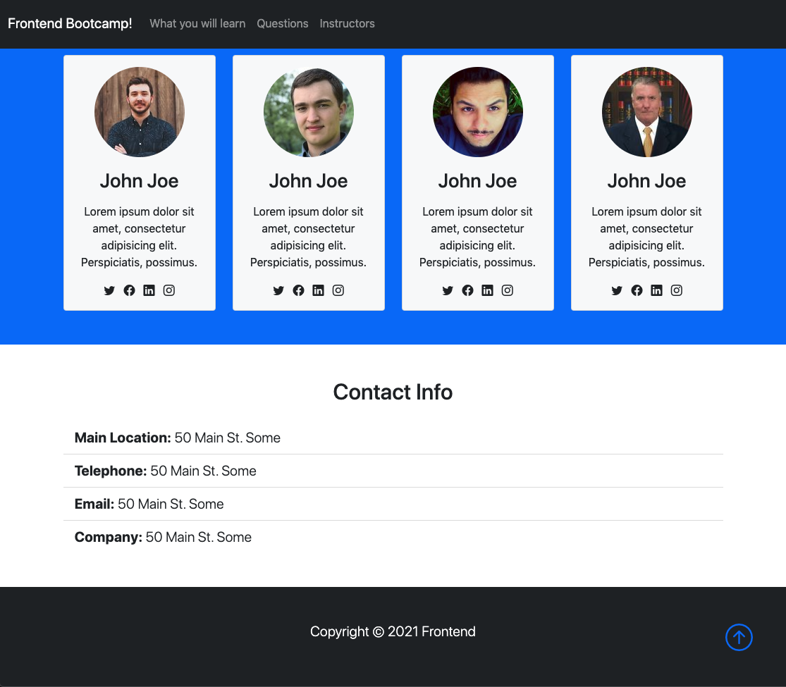
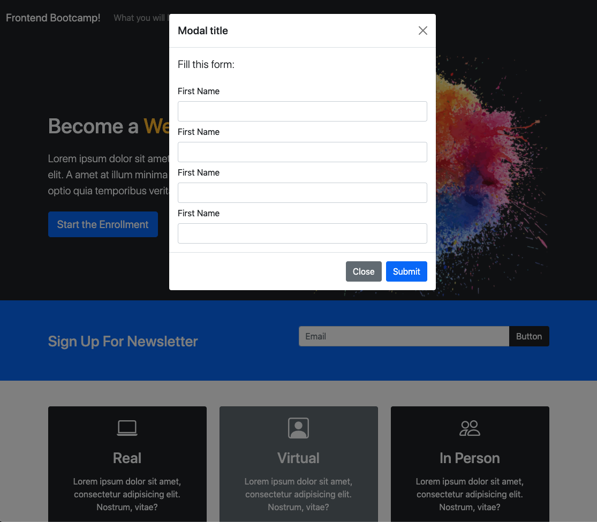

# Learning Bootstrap

## About

Quickly design and customize responsive mobile-first sites with Bootstrap, the world’s most popular front-end open source toolkit, featuring Sass variables and mixins, responsive grid system, extensive prebuilt components, and powerful JavaScript plugins.

## The Website

## Credits

- [Bootstrap](https://getbootstrap.com/)
- [Bootstrap - Docs](https://getbootstrap.com/docs/5.0/getting-started/introduction/)
- [Bootstrap 5 Crash Course | Website Build & Deploy](https://www.youtube.com/watch?v=4sosXZsdy-s&ab_channel=TraversyMedia)
- [Mac: Cmd+Shift+R - hard refresh](https://stackoverflow.com/questions/41144565/flask-does-not-see-change-in-js-file)

